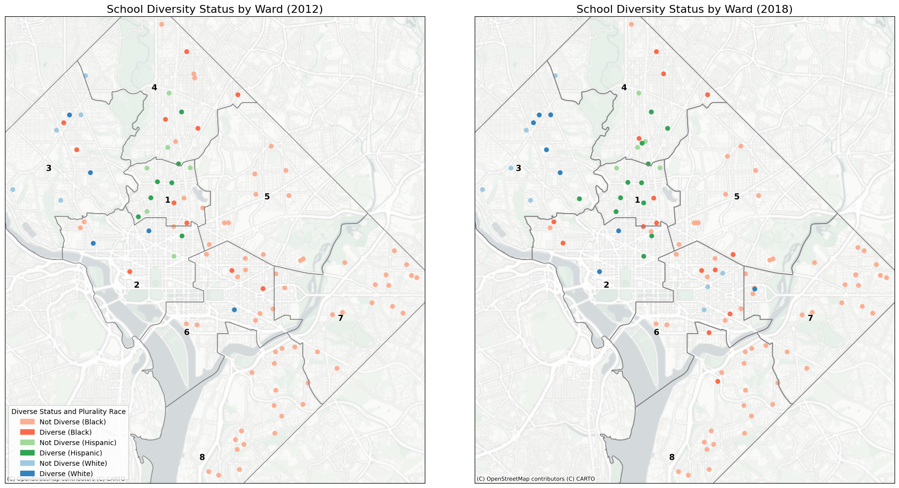
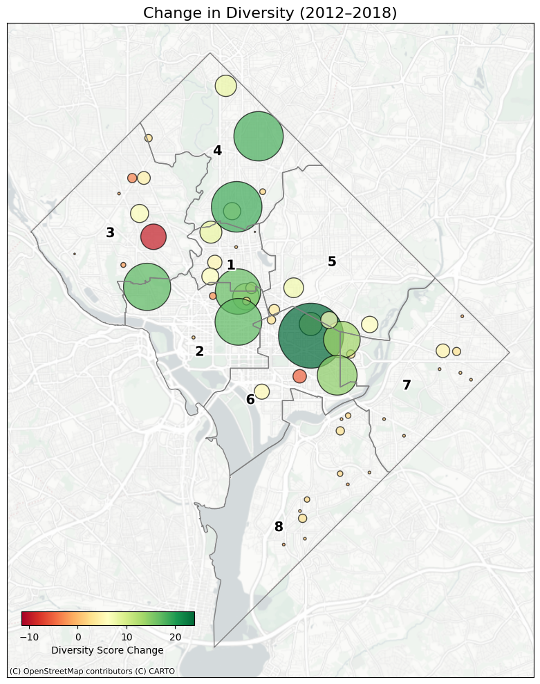

# Exploring Changes in Racial Diversity and Impact on Educational Outcomes in D.C. Public Schools (DCPS) (2012–2018)

**Submitted by:** *Sahar Khan Sherwani, MPP-MPI 2024, Edward J. Bloustein School of Planning and Public Policy, Rutgers University*  
**Final Project Submitted for:** *Command-Line GIS (Fall 2024)*  
**Course Professor:** *Will Payne, Ph.D.*

---

## Focus of This Project

This project examines how the **racial and ethnic composition**—with a particular emphasis on **Black and Hispanic student populations**—in Washington, D.C. public schools (DCPS) evolved between **School Year (SY) 2012–2013 and SY 2018–2019**, and how these shifts may correlate with educational outcomes and resource changes.

Key objectives include:
- Analyzing the changes in minority (Black and Hispanic) racial and ethnic composition across the two timeframes.
- Exploring whether shifts in school demographics have an assocition with educational outcomes (i.e., school performance) or changes in the school system (i,e., closures, new openings), to understand the impact of evolving diversity.

---

#### Research Questions

1. **How has the racial composition of D.C. public schools changed between the 2012–2013 and 2018–2019 school years?**
2. **How do changes in racial and ethnic composition (especially Black and Hispanic populations) relate to educational outcomes or changes resource allocations?**

---

## Background

- **Diverse Demographics:**  
  Washington, D.C., though geographically compact, is demographically intricate—each of its **eight wards** mirrors distinct community identities and population trends. The local schools often reflect these broader neighborhood demographics.

- **Legacy of Segregation and Integration Efforts:**  
  While landmark cases like *Bolling v. Sharpe (1954)* sought to dismantle de jure segregation in DCPS, **de facto segregation persists**, with many schools still predominantly serving one racial or ethnic group. This legacy highlights the complexity of achieving meaningful integration in practice.

- **Benefits of Racially Diverse Schools:**  
  Social science research indicates that **greater racial and ethnic diversity within schools can enhance resource allocation, foster peer learning, and improve long-term student outcomes**. Diverse academic environments have the potential to bridge achievement gaps and promote equity across the educational landscape.

---

### **Datasets and Sources:**  
*Note: All datasets were reprojected into `Maryland State Plane (EPSG:2248)` to ensure spatial consistency*
1. **Hispanic or Latino Origin by Race (Table B03002) American Community Survey (ACS) 5-Year Estimates (2012 & 2018)**  
  - *Source: [U.S. Census Bureau](https://data.census.gov/table/ACSDT1Y2021.B03002)*
  - The data was accessed via the Census API, and included estimates (E) and margins of error (M) for each racial category. For the purposes of this project, only D.C. state level census tract data was then brought in and matched to these.
  - CVs were calculated using `census_data_aggregator` to determine data reliability, and the zero or missing population values were replaced with `NaN` to avoid division errors. Tracts with low reliability (CV ≥ 40%) were marked using overlay. One issue, potentially related to data quality and small smaple sizes in certain tracts and wards, many estimates were marked as low reliability, particularly for Hispanic and White population maps in 2012. These were seen to improve in 2018 (Hispanic population reliable tracts increased from 82 to 112, and for White population from 124 to 140 - from total 179). 
  - For effective mapping, all layers (Ward, tracts etc) were reprojected to EPSG:2248.
  - Applied **Fisher-Jenks classification** based on the 2018 distribution and used the same breaks for 2012 to ensure consistency across temporal comparisons.
2. **2012 DCPS Dataset**  
   - *Source: [DC Public Schools Race Data (SY 2012–2013)](https://gist.github.com/asizer/8dc36ebf1a2697905f70)*  
   - This data was found from Github, compiled in 2013 from DCPS enrollment records SY 2012-2013. This dataset was apt for this project as it provided school-level enrollements data segmented by racial and ethnic demoraphics, and also coordinates (for plotting). Data cleaning and adjustments were performed, including calculations (discussed later). Since coordinates were included, direct conversion to a GeoDataFrame was straightforward, requiring only a reprojecting step. This was used to map 2012 related data for Map 2a and 2b. 

3. **2018 DCPS STAR Enrollment Data (SY 2018–2019) Dataset**  
   - **Source:[DCPS](https://opendata.dc.gov/datasets/b48c7faa47bd48ddb3184eff4b4cdf60_0). This consisted of school-level enrollements data segmented by racial and ethnic demoraphics for SY 2018-2019. The format of this dataset was very tricky and required extensive data cleaning, adjustments, and pivoting - inorder for it to match format of others for effetive join. 
4. **DC Public Schools Data (Latest) Dataset**   
   - **Source:[DCPS](https://opendata.dc.gov/datasets/DCGIS::dc-public-schools/). This included point data for all DCPS schools currently having active or open status. This GeoJSON was left joined with the enrollemnts data to get spatial coordinates using School Name. 
5. **Closed DC Public Schools Data (Latest) Dataset**    
   - **Source:[DCPS](https://opendata.dc.gov/datasets/DCGIS::closed-public-schools/). This included point data for all DCPS schools currently having inactive or status. This GeoJSON was also left joined with the enrollemnts data to get spatial coordinates using School Name. Luckily, all the datasets had entered school names in standardized format. 
   - The three above mentioned datasets were used to map 2018 related data for Map 2a and 2b.
   - Even after the left join, there were 24 schools that were missing geometries as they were not found in any of the datasets. So, I did **geocoding** of the remaining 25 missing points via ESRI’s geocoder. Ultimately, a complete set of school points was obtained and reprojected to EPSG:2248.

## Minority Racial and Ethnic Demographic Changes in DC (2012 and 2018)
- Looking at the demographic makeup of Washington, D.C., three primary groups—**White**, **Non-Hispanic Black**, and **Hispanic**—account for nearly **95%** of the total population. Given their prominence, these three populations form the core focus of this analysis. To emphasize shifts within the two minority communities (**Non-Hispanic Black** and **Hispanic**), we specifically computed each group’s percentage share of the total population:
  
      `Non-Hispanic Black Population % = (Non-Hispanic Black Population (Estimate) / Total Population (Estimate) * 100`
            `Hispanic Population % = (Hispanic Population (Estimate) / Total Population (Estimate) * 100`
  
- These derived percentages facilitate direct comparisons across different time frames and census tracts, providing clearer insights into how these communities’ spatial distributions and relative proportions have evolved. Moreover, Fisher-Jenks classification based on the 2018 distribution were first found and same breaks were used for 2012 to ensure consistency across temporal comparisons. To show side by side comparisons, small multiples appraoch was used. 

### **Map 1: Non-Hispanic Black % in D.C. Census Tracts (2012 & 2018)**  

.png)

The maps show that, between 2012 and 2018, the **geographic distribution of the Non-Hispanic Black, Hispanic and White population has shifted in ways that highlight broader demographic transitions within D.C.** Notably, **Wards 7 and 8 experienced an increase in Non-Hispanic Black percentages**, with **Wards 1, 4, and 5 witnessed declines**. Comparatively, **Hispanic population have seen more spread across all wards, expect for Ward 7 and 8**, which largely remain Black. Meanwhile, **White populations have increased noticeably in Wards 2, 3, and 6,** potentially reflecting patterns of redevelopment, gentrification, and shifting housing markets that have drawn more White and Hispanic residents into previously majority-Black neighborhoods.

**Although the city’s overall population may be growing more diverse, the spatial patterns suggest that certain wards remain predominantly one group, indicating that some form of racial and ethnic clustering persists.** In other words, while a city-wide perspective hints at increasing diversity, the localized view raises questions about whether this diversity is evenly distributed or concentrated in certain areas, potentially influencing access to resources and long-term educational outcomes.

---

## Status of Diversity D.C. Public Schools (2012 and 2018)
Simialar to the approach followed above, this section also focused on Non-Hispanic Black, Hispanic, and White students to understand the status of diversity at DCPS. This required all the total enrollments be recaclualted by finding the counts of each racial groups based on the original count, and then recalculating the new adjusted percentage of each group.

For the analysis, following are the metrics that were created, along with their caluclations. Guidance was taken from [D.C. Policy Center's approach](https://www.dcpolicycenter.org/publications/landscape-of-diversity-in-dc-public-schools/). 

     Race & Diversity Metrics:
      
      `Plurality Race: race with the highest percentage at a given school (using idmax value)`

      `Majority Race: If the plurality race percentage is >70% 
            then `majority race` = `Plurality_Race`, else none.`

      `Diverse Status: School is considered "Not Diverse" (if Plurality Race >70%); 
                                            "Diverse" (if no group >70%).`

      `Diversity Score: % sum of all OTHER groups besides the plurality group.
         - A higher score indicates balanced racial distribution so more diverse.`

The above map is presented as **small multiples** to visually compare 2012 and 2018 simultaneously. Each subplot uses the same color dictionary and symbology, ensuring straightforward interpretation. The `adjustText` library aids in preventing label collisions, ensuring a cleaner presentation.

---

---

## Interactive Map: DC Public Schools (2018)

##### *Below is an interactive map overlaying school-level data on diversity and STAR ratings. You can use the layer control (top-right corner) to toggle between different datasets (Diversity & Plurality Status, School STAR Rating, and Wards). Hovering over a school marker displays basic details, and clicking on a marker opens a pop-up with more in-depth information.*

<iframe src="final_map_nb (1).html" height="850" width="900"></iframe>
*You can explore this map [as its own web page here](final_map_nb (1).html).*

